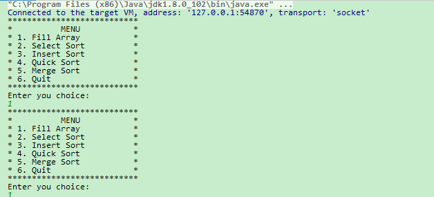

<h1 align="center">四种排序算法</h1>

## 简介
毕业设计：控制台程序实现四种排序算法功能，包括填充数组、选择排序、插入排序、快速排序和归并排序，用户可通过数字选择操作，支持重复选择和退出。    --计算机毕业设计源码；毕设源码；java毕业设计源码

## 联系方式

<h3 align="center">获取完整代码与数据库文件 + 微信：deepguan QQ: 86050149 QQ群: 783742310</h3>

<h3 align="center">可帮忙远程部署 包运行成功！提供远程部署、修改代码、设计文档指导、代码讲解等服务！</h3>

## 功能介绍（完整见运行截图）
用户：菜单功能：选择填充数组，选择排序（Select Sort），插入排序（Insert Sort），快速排序（Quick Sort），归并排序（Merge Sort），和退出程序。 操作：通过输入相应的数字来选择不同的操作。系统行为：界面重复显示菜单以允许用户反复选择不同的功能。连接：程序在本地运行，通过套接字进行某种方式的连接。

## 运行截图

本代码来源于网络,仅供学习参考使用!

